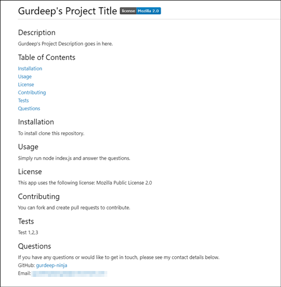

# README.md Generator 

## Description
A command line application that dynamically generates a professional README.md file for your projects. Simply answer the questions for the corresponding section and that section will appear in the generated README.md file. A license badge will also be displayed if you selected a license for your project.

## Table of Contents
[Installation](#installation)<br>
[Usage](#usage)<br>
[License](#license)<br>
[Contributing](#contributing)<br>
[Questions](#questions)<br>
[Screenshots](#screenshots)<br>

## Installation
To use this application, you must have ```node``` & ```npm``` installed.

To install, please make a clone of this repository to your local pc or web server.

Once you have cloned the repository, run the ```npm install``` command to download the project dependencies.

## Usage
To start the application, run the command ```node index.js```

You will be prompted a series of questions for the sections you want generated for your README.md file.

## License
This app uses the following license: Mozilla Public License 2.0

## Contributing
To contribute to this project simply fork this repository on GitHub and create pull requests. I will then merge your changes after a review.

## Questions
If you have any questions or would like to get in touch, please see my contact details below.<br>
GitHub: [gurdeep-ninja](https://github.com/gurdeep-ninja)<br>

## Screenshots
<br>
